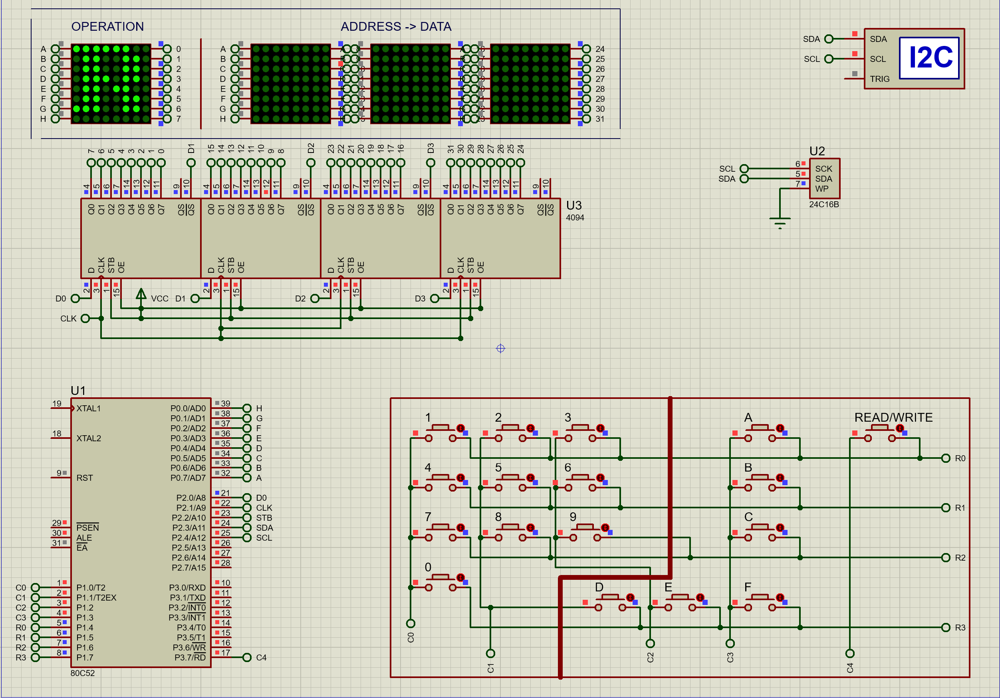

# P_MM_G05: 24C16 I2C Read/Write (A51 Assembly)

Read and write to a 24C16 EEPROM (functional unit) over I2C, written in Keil A51 assembly. The MCU uses a 4×4 matrix keypad for address and data entry, a R/W button to choose read or write, and a 4-digit dot-matrix display (via 4094 shift register) to show address, operation, and data.

## How the project works

- **I2C:** Bit-banged I2C on SDA (P2.3) and SCL (P2.4). The 24C16 has 2048 bytes; addressing is 0x000–0x7FF.
- **R/W button (P2.5):** Closed = Read, Open = Write. After you press any key, the algorithm checks this and runs the chosen operation.
- **Display:** Shows `- - - -` at idle. For Read it shows `R` + 3-digit address, then the byte read. For Write it shows `W` + address, then you enter 2 hex digits and the byte is written.
- **Keypad (P1):** 4×4 matrix, keys 0–9 and A–F for hex address and data.

Keil project: `mem_rw1.uvproj` (output `mem_rw1.hex`). Optional Proteus simulation: `MEM_RW.pdsprj`.

Proteus simulation view:

## Requirements

- Keil µVision (8051 toolchain) to build the `.hex`
- AT89C52 (or compatible) @ 24 MHz
- 24C16 (or 24C08/24C32) I2C EEPROM
- 4094 shift register, 4-digit dot-matrix display, 4×4 keypad, R/W button
- Or use the Proteus project to simulate

## Pin summary

| Function   | Pin  |
|-----------|------|
| 4094 DAT  | P2.0 |
| 4094 CLK  | P2.1 |
| 4094 STR  | P2.2 |
| I2C SDA   | P2.3 |
| I2C SCL   | P2.4 |
| R/W button| P2.5 |
| Keypad    | P1   |
| Display   | P0   |

## Build

1. Open `mem_rw1.uvproj` in Keil µVision.
2. Build (F7). Output: `Objects/mem_rw1.hex`.

## Flash / Proteus

- Flash `mem_rw1.hex` to the MCU with your programmer, or
- In Proteus, open `MEM_RW.pdsprj`, set the MCU Program File to `mem_rw1.hex`, and run the simulation.

## I2C usage (24C16)

- **Write:** Start → device address 0xA0 + upper address bits → byte address (high then low) → data byte → Stop.
- **Read:** Start → 0xA0 + address → byte address → Restart → 0xA1 → read byte → NAK → Stop.

The code implements Start, Restart, Stop, Send byte, Receive byte, ACK, and NAK in assembly.
